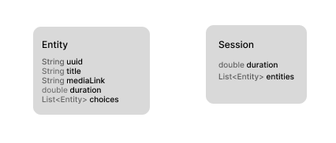
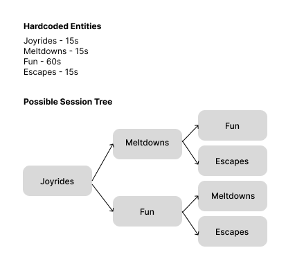

# Interactive video session system

A non linear video session system where the next chapters depend on the selections the user makes throughout the session.

Each session is made up of "Entities". Each "Entity" can have 2 possible entities as possible next choices, which in turn can have their own set of next choices. A basic possible flow is illustrated below.

DEMO VIDEO: https://youtu.be/Fj4aM8jPLb8




There are many computations made inside the app to make sure the video works as intended. These computations are handled using proper state management in BLoC. This makes sure that there is proper seperation of intents for the code & there is no overlap between UI & Business logic. 

```
part of 'app_bloc.dart';

@freezed
class AppState with _$AppState {
  const factory AppState({

    //Indicates the current position value of the entire session in seconds
    required double currentPosition,

    //Boolean flag to check whether to show choices for the next chapter
    required bool showChoices,

    //Current index of the chapters inside the session
    required int currentIndex,

    //Current seek value of the active chapter within the entity list
    required double currentVideoSeek,

    //Breakpoints where the chapter changes
    required List<double> breakpoints,

    //Flag to reset current chapter seek
    required bool restartChapter,

    //The session object itself. This is modified to add/remove chapters based on user's choices
    Session? session,
  }) = _AppState;
}

```

```
part of 'app_bloc.dart';

class AppEvent {
  const AppEvent();
}

//Initialize the session by loading data. This is currently hardcoded and is for demonstration purposes only. In reality, the data will be pulled from a backend.
class InitializeSession extends AppEvent {}

//Reset session event
class RestartSession extends AppEvent {}

//Restart Chapter event
class RestartChapter extends AppEvent {
  const RestartChapter({required this.val});
  final bool val;
}

//Go back to the previous chapter
class GoPreviousChapter extends AppEvent {}

//This event is added every second to keep track of the current video position, calculate 
class RuntimeBroker extends AppEvent {
  const RuntimeBroker({required this.position});

  final double position;
}

//User selects from a choice of entities provided from this
class ChoiceSelection extends AppEvent {
  const ChoiceSelection({required this.entity});
  final Entity entity;
}

```